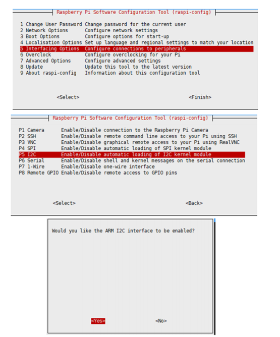
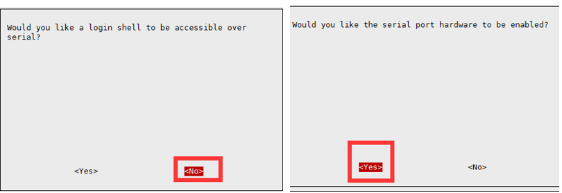

# PiFinger
PiFinger, the first-ever Fingerprint HAT for Raspberry Pi Comprise of onboard Nuvoton MCU with an on-chip crypto-accelerator, Cortex-M23 TrustZone, and XOM facilities. A user can use the communication protocol to the PiFinger with commands over the UART protocol with the Baud rate 115200 bps or USB 2.0 full speed.

<b> Communication Protocol : </b> https://github.com/sbcshop/PiFinger/wiki/Communication-Protocol


### PINOUT

|  PiFinger Peripheral |  Raspberry Pi Pin (BCM) |
| -------------------- |  ---------------------  |
|  Fingerprint TX      |    GPIO15 (RXD)         |
|  Fingerprint RX      |    GPIO14 (TXD)         |
|  OLED SDA            |    GPIO2  (SDA)         |
|  OLED SCL            |    GPIO3  (SCL)         |
|  BUZZER              |    GPIO13               |

Note: First registered fingerprint will act as administrator Fingerprint, You have to confirm admin fingerprint before running any command once registered fingerprint. Else device will stay in compare mode. 

### Enable I2C and Serial Interface for Raspberry Pi (Not required in case of windows)

 Open a terminal and run the following commands to enable I2C and Serial：


* ``` sudo raspi-config ```

Choose Interfacing Options -> I2C ->yes 




* ``` sudo raspi-config ```

Choose Interfacing Options -> Serial -> No -> Yes



## Testing

* Connect PiFinger on top of 40 pin stackable GPIO header of Raspberry Pi.
* Now Clone/Download PiFinger Repository by running below command or directly download from github

``` git clone https://github.com/sbcshop/PiFinger.git ```

* Open cloned/downloaded folder and choose your environment folder (i.e : Raspberry Pi or Windows)

### For Raspberry Pi

Run PiFinger GUI by running below command:

``` python3 PiFinger_GUI.py ``` or using any python3 supported ide.

Select <b>COM port</b> and Baud Rate ( default is 9600) from above GUI ("/dev/ttyS0" in case of default connection), 
and click on connect button to start communication with fingerprint sensor.


#### GUI Features 

1) Compare Fingerprint - Option to Compare registered Fingerprint.

2) Add Fingerprint - Add New Fingerprint, will assign an ID for each successful registration.

3) Remove Fingerprint ( By ID) - Remove registered Fingerprint for a specific ID.

4) Remove All Fingerprint (Registered) - Remove all fingeprint in a single click.

### LED display explanation

The LED light of the PiFinger shows the current working status.

If the LED1 and the LED2 flash in turn, it means that the PiFinger is in operation mode. If the LED1 or the LED2 is blinking alone, it means that the PiFinger is in the demo mode.

The PiFinger will be in the demo mode after powered on or reset. Send any command to it will make it leave demo mode and enter operation mode immediately, and it will
process the received command. When the PiFinger is in operation mode, only power on or reset it can make it back to demo mode.


